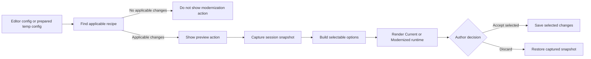

# Modernization System

This document explains why COVE has an editor modernization system, how modernization recipes are selected and applied, how dashboards are handled, and how the review workspace protects an author's current configuration.

Use this doc when:

- adding or changing a modernization recipe,
- changing the modernization entry action or review workspace,
- debugging why modernization is or is not offered for a config,
- working on dashboard, nested-dashboard, or multidashboard modernization,
- adding a visualization type to the modernization workflow,
- deciding whether a compatibility change belongs in a migration or a modernization recipe.

---

## Why Modernization Exists

COVE configurations can remain valid for years while recommended visual conventions evolve. Automatically rewriting every valid legacy choice would be risky: it could change a published visualization's appearance, editorial hierarchy, or data presentation without an author reviewing the result.

Modernization provides an opt-in path instead. It detects older or non-recommended settings, proposes only the changes that apply to the current configuration, renders the result for comparison, and commits changes only when the author accepts them.

The system is designed around four principles:

1. **Author control.** A modernization is never committed merely because a config was opened.
2. **Config-driven behavior.** Applicability is determined from the captured config, not only its saved version.
3. **Atomic review.** Each independent recommendation has a stable ID and can be reviewed or accepted separately.
4. **Compatibility.** Existing aggregate recipes continue to work, and no visualization-package API or consumer config wrapper is required solely for modernization.

Modernization is an editor workflow, not a new consumer-facing configuration format. The accepted result is an ordinary COVE config containing fields the visualization packages already understand.

## Modernization Versus Config Migration

Modernization recipes and shared config migrations solve different problems.

| Concern | Modernization recipe | Config migration |
|---|---|---|
| Purpose | Offer recommended visual or authoring choices | Repair or normalize config structure for compatibility |
| Trigger | Author starts the modernization workflow | `coveUpdateWorker` loads an eligible saved config |
| Approval | Explicit author acceptance | Automatic when migration rules apply |
| Eligibility | `shouldApply(config)` and recipe type matching | Saved version and migration ordering |
| Output | Normal config with selected recommendations | Normalized config stamped by the migration system |

For example, the `4.26.8` migration flattens accidentally nested chart axis objects and backfills right-axis title placement. That is structural repair needed for reliable runtime and editor behavior. Recommendations such as moving an eligible axis title, changing legend placement, or collapsing a data table belong to modernization because they alter valid presentation choices.

See [`MIGRATION_SYSTEM.md`](./MIGRATION_SYSTEM.md) before changing shared migrations.

## System Overview



The session lifecycle lives in `packages/editor/src/hooks/useModernizationSession.ts`, with `packages/editor/src/CdcEditor.tsx` providing the editor integration boundary. Recipe definitions and aggregation live in `packages/editor/src/helpers/modernizationRecipes.ts`.

## Core Concepts

### `ModernizationChange`

A `ModernizationChange` is one atomic recommendation. It contains:

- a stable `id`,
- a user-facing `label`,
- `shouldApply(config)` eligibility logic,
- an `apply(config)` transformation,
- one or more editor breadcrumbs,
- optional before/after detail formatting for displayed values.

Atomic definitions are the source of truth. Each change should describe one decision that can be enabled without requiring unrelated recommendations.

### `ModernizationOption`

A `ModernizationOption` is the review-ready form of an applicable atomic change. It carries the ID, label, breadcrumbs, optional formatted values, and an apply function used by the workspace.

Options are derived only from changes that apply to the captured config. Their apply functions clone their input so the workspace can safely recompute any selected subset.

### `ModernizationRecipe`

A `ModernizationRecipe` represents all modernization work available for one configuration. It includes:

- the visualization type or predicate it applies to,
- the aggregate `apply` function,
- aggregate editor locations and details,
- selectable `options` when the recipe exposes atomic changes.

The aggregate apply path is retained for backward compatibility and non-workspace callers. `getModernizationOptions()` returns the recipe's atomic options; a legacy custom recipe without options receives one synthetic option that wraps its aggregate apply function.

## Recipe Selection and Application

`getModernizationRecipe(config)` follows this order:

1. Check the exported `modernizationRecipes` registry for a configured custom recipe whose `appliesTo` rule matches and whose `apply` function changes the config.
2. Otherwise, dispatch to the built-in recipe builder for the config type.
3. Filter that type's atomic definitions through `shouldApply(config)`.
4. Return no recipe when no atomic change applies.

This last rule controls entry-action visibility: already-modernized configs should not be invited into an empty workflow.

Built-in options and aggregate recipes are created from the same filtered atomic definitions. This keeps “apply all” behavior consistent with selecting every option individually.

### Supported recipe families

The exact atomic definitions in `modernizationRecipes.ts` are canonical. At a high level, the built-in families cover:

| Config type | Recommendation areas |
|---|---|
| Chart | Titles, axes, ticks, labels, gridlines, number/date formatting, legends, tables, supported bar styling, and Palette 2.0 → 2.1 upgrades |
| Map | Title style, eligible state labels, table state, eligible legend presentation, and Palette 2.0 → 2.1 upgrades |
| Data bite | TP5 presentation and number formatting |
| Waffle/gauge | TP5 visualization variants and number formatting |
| Markup include | Eligible non-TP5 title presentation |
| Dashboard | Dashboard title hierarchy, image-download presentation, and applicable child recipes |

Applicability rules matter as much as target values. A recommendation should be offered only when the visualization type, orientation, data shape, or current settings make it valid.

Palette modernization applies only when `general.palette.version` is explicitly `2.0`. It changes only the version to `2.1`, preserving the palette name, reversal, custom colors, assignments, backups, and other metadata. Palette 1.0 and unversioned configurations remain in the separate legacy palette-conversion workflow and must not receive this modernization option.

Map legend-style eligibility is intentionally configuration-only. Supported non-gradient legends are offered the gradient style unless their effective palette is explicitly qualitative (including colorblind-safe qualitative palettes). Do not inspect category rows, parse category labels, or depend on dashboard/remote dataset availability for this decision.

## Dashboard Modernization

Dashboards require a plan rather than a single shallow transformation because modernizable configs may appear in several places:

- the dashboard's own settings,
- direct child visualizations,
- dashboard visualizations nested inside `visualizations`,
- entries in `multiDashboards`, including their descendants.

`buildDashboardModernizationPlan()` walks those structures recursively. It builds both:

- an aggregate apply function that updates every applicable location, and
- selectable options grouped by atomic change ID.

Grouping means repeated occurrences of the same recommendation appear as one switch. Its composed apply function updates every applicable occurrence across the dashboard tree. This is intentional: an atomic ID represents one modernization decision, even when that decision is repeated in multiple dashboard children.

Editor breadcrumbs are prefixed by child category, such as `Charts`, `Maps`, or `Markup Includes`, then deduplicated. When the same breadcrumb would produce different target values in different dashboards, its displayed value becomes `Varies by dashboard`.

Dashboard title hierarchy is data-dependent. The dashboard uses a large title when a placed chart, map, or markup include has a visible, non-empty title; otherwise it uses a small title. Only visualizations referenced by placed dashboard widgets contribute to this decision.

When changing recursion, test direct children, nested dashboards, and multidashboards together. A solution that handles only `config.visualizations` is incomplete.

## Editor Entry Points

`CdcEditor` publishes `modernStylesAction` through `EditorContext` only when a recipe is available and no modernization session is already active. `ModernStylesAction` renders the shared entry-action markup in visualization editor panels. The action label is:

`Preview a modernized version of this {chart|map|dashboard|visualization}`

The visible action is currently integrated into:

- the chart editor panel,
- the map editor panel,
- the dashboard visualizations panel.

Recipe and runtime-renderer support also exists for standalone data bites, waffle/gauge charts, and markup includes. A standalone type still needs an editor surface that renders `modernStylesAction` before an author can initiate the workflow from that editor. Dashboard-contained instances are discovered through dashboard recursion and do not need their own entry action.

Do not render the action when `getModernizationRecipe()` returns nothing. Do not expose it inside an active modernization session.

## Session and Snapshot Lifecycle

Modernization starts from `state.tempConfig || state.config`. `useModernizationSession` owns this lifecycle. This is important because an author may have unsaved session edits prepared by a visualization editor. Those edits must be part of both the comparison and the configuration restored by Discard.

On entry, `CdcEditor` captures:

- a cloned `originalConfig`,
- the applicable recipe,
- all option IDs as the initial selection,
- whether the author has customized that selection.

The Modernized config is recomputed by reducing the selected options over a fresh clone of `originalConfig`. Never toggle a change into or out of the previously rendered preview; incremental mutation can retain deselected values and makes option order difficult to reason about.

While the session is active, `setTempConfigAndUpdate` returns without accepting visualization-editor writes. The workspace uses runtime renderers, but the guard remains a defense against unexpected package callbacks.

Completion has two explicit paths:

- **Accept:** save the config produced by the selected options, set `tracking.modernizationAccepted` to `true`, and close the workspace. Acceptance is disabled when no options are selected.
- **Discard:** restore the captured original visualization settings, set `tracking.modernizationDiscarded` to `true`, save, and close the workspace. Because the snapshot includes session edits made before entry, Discard does not roll the author back farther than the start of the modernization session.

Both paths use the normal editor reducer and config event lifecycle after the decision is made. Merely comparing views or changing selections does not commit configuration.

The optional tracking booleans record whether each outcome has ever occurred. They are absent until the corresponding action occurs, both may become `true`, and existing properties in `tracking` must be preserved. For dashboards, tracking belongs only to the root config even when modernization changes nested visualizations.

## Review Workspace

When modernization is active, `ModernStylesWorkspace` replaces the normal editor tabs rather than hiding editor chrome inside a visualization package.

The workspace has:

- a fixed 350px control column,
- pinned accept/discard/disclosure actions,
- an independently scrolling change list,
- an independently scrolling runtime preview,
- Current and Modernized comparison views.

All applicable options begin selected and the preview begins in Modernized. Opening `Review changes individually` also selects Modernized. Current preserves the selected IDs but disables switches and bulk-selection controls so the displayed current config cannot be mistaken for an editable modernization result.

The primary action reads `Accept all changes` until the selection is customized. After customization it reads `Accept N changes`, including the disabled zero-selection state.

## Rendering Architecture

`VisualizationRenderer` owns the visualization-type switch previously embedded in `ConfigureTab`.

- `ConfigureTab` uses it in `editor` mode.
- `ModernStylesWorkspace` uses it in `runtime` mode.

Runtime mode is used for charts, maps, dashboards, data bites, supported waffle/gauge variants, and markup includes. Data tables remain available to the normal configure renderer but do not currently have a modernization recipe.

The workspace keys the runtime renderer by both comparison view and the sorted selected option IDs. This forces a clean mount whenever the displayed config meaningfully changes. The remount is necessary because several visualization packages initialize internal state from config on mount and do not reliably reset every stateful subsystem when a new config prop arrives.

Keep the switch editor-owned. Modernization should not require visualization packages to gain a modernization-specific public API.

## Adding or Changing a Recipe

1. Add or update one atomic definition in the appropriate change array.
2. Give it a stable, globally meaningful ID within the modernization system.
3. Make `shouldApply` narrow enough to exclude unsupported and already-modern states.
4. Make `apply` preserve unrelated config fields and return a new config object.
5. Add every affected full editor breadcrumb.
6. Add formatted location details when the resulting value helps authors understand the change.
7. Test applicability, non-applicability, input immutability, and the exact resulting fields.
8. For child-supported types, test dashboard recursion and repeated occurrence aggregation.

Prefer a new atomic change over expanding an existing change to cover an independently selectable decision. Preserve existing IDs unless the underlying meaning genuinely changes.

If a new visualization type should participate end to end, it needs:

- a built-in recipe builder or registered custom recipe,
- a `getModernizationRecipe` dispatch path,
- dashboard-child routing when dashboards can contain it,
- a runtime branch in `VisualizationRenderer`,
- a real editor location that renders `modernStylesAction`,
- recipe and editor/workspace tests.

## Invariants and Common Failure Modes

- Always clone the captured config before applying recipes or options.
- Always recompute selected results from the original snapshot.
- Never show a recipe that produces no config change.
- Keep atomic option IDs stable and unique by meaning.
- Keep aggregate apply behavior equivalent to applying every option.
- Preserve custom-recipe precedence and the legacy one-option fallback.
- Recurse through nested dashboards and `multiDashboards`, not only direct children.
- Deduplicate dashboard breadcrumbs without dropping affected occurrences from the apply function.
- Keep Current mode read-only while preserving selections.
- Keep renderer keys dependent on view and sorted selected IDs.
- Do not use CSS to hide an editor-mode visualization and call it a runtime preview.
- Do not turn an author-choice modernization into an automatic migration.

## Development Fixture Support

The standalone editor development server aggregates example configs from the visualization packages. This makes it possible to exercise modernization against real chart, map, dashboard, data-bite, table, markup, and waffle examples from one editor sidebar.

`packages/core/generateViteConfig.js` exposes the aggregated example paths for the editor Vite configuration. `packages/core/devTemplate/dev.js` rewrites relative data and config URLs to their source package paths before injecting the selected config into the editor container. This is development infrastructure, not part of production recipe selection or saved configuration behavior.

When a modernization works in an isolated unit fixture but fails against a real example, check the aggregated URL rewriting and injected config before changing recipe applicability.

## Key Files

| File | Role |
|---|---|
| `packages/editor/src/helpers/modernizationRecipes.ts` | Atomic definitions, recipe selection, option conversion, and dashboard aggregation |
| `packages/editor/src/CdcEditor.tsx` | Editor integration, guarded writes, context wiring, and workspace routing |
| `packages/editor/src/hooks/useModernizationSession.ts` | Availability, session snapshot, selection recomputation, and accept/discard lifecycle |
| `packages/core/contexts/EditorContext.ts` | Shared modernization entry-action contract |
| `packages/core/components/EditorPanel/ModernStylesAction.tsx` | Shared entry-action rendering for visualization editor panels |
| `packages/editor/src/components/ModernStylesWorkspace.tsx` | Review controls, option checklist, and comparison UI |
| `packages/editor/src/components/VisualizationRenderer.tsx` | Shared editor/runtime visualization switch |
| `packages/editor/src/components/ConfigureTab.tsx` | Normal editor-mode renderer entry |
| `packages/editor/src/scss/modernization.scss` | Entry-action and workspace layout styles |
| `packages/core/helpers/markConfigTracking.ts` | Immutable helper for recording typed config-tracking flags |
| `packages/chart/src/components/EditorPanel/EditorPanel.tsx` | Chart entry-action placement |
| `packages/map/src/components/EditorPanel/components/EditorPanel.tsx` | Map entry-action placement |
| `packages/dashboard/src/components/VisualizationsPanel/VisualizationsPanel.tsx` | Dashboard entry-action placement |
| `packages/core/generateViteConfig.js` and `packages/core/devTemplate/dev.js` | Aggregated real-example support for standalone editor development |
| `packages/core/helpers/ver/4.26.8.ts` | Related structural axis repair; not a modernization recipe |

## Testing

The primary recipe tests are in `packages/editor/src/helpers/modernizationRecipes.test.ts`. They should cover:

- applicable and non-applicable states,
- exact transformations and input immutability,
- independently selectable options,
- multiple breadcrumbs for one atomic change,
- subsets applied from the original snapshot,
- direct, nested, and multidashboard recursion,
- repeated-ID aggregation and mixed breadcrumb values,
- legacy custom-recipe fallback.

The editor workflow tests are in `packages/editor/src/test/CdcEditor.test.tsx`. They should cover:

- action visibility,
- captured temp-config behavior,
- workspace replacement of normal tabs,
- Current and Modernized comparison,
- selection counts and bulk controls,
- partial and full acceptance,
- immediate discard,
- guarded editor updates,
- runtime mode and clean remounting for supported visualization types.

The real-chart interaction is in `packages/editor/src/_stories/Editor.stories.tsx`.

Targeted commands:

```sh
yarn test-unit:quick -- --scope @cdc/editor -- src/helpers/modernizationRecipes.test.ts
yarn test-unit:quick -- --scope @cdc/editor -- src/test/CdcEditor.test.tsx
yarn test-storybook:quick packages/editor/src/_stories/Editor.stories.tsx
git diff --check
```

When a change also touches structural config repair, run the relevant migration test separately and follow [`MIGRATION_SYSTEM.md`](./MIGRATION_SYSTEM.md).
