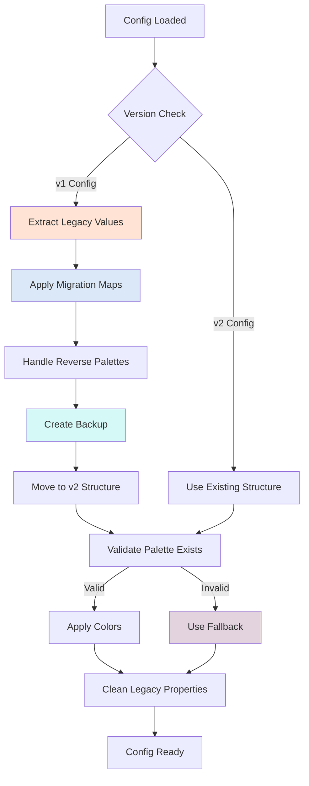

# Color Palette Migration Guide v2

## Overview

Version 4.25.9 introduces a major refactoring of the color palette system to provide:
- **Standardized naming conventions** using underscores instead of hyphens/spaces
- **Versioned palette structure** for backward compatibility
- **Centralized palette management** in the `@cdc/core` package
- **Automatic migration** of existing configurations
- **Developer rollback features** for debugging and testing
- **Enhanced migration utilities** with comprehensive fallback handling

## Key Architectural Changes

### 1. Centralized Migration System
- **Core helpers**: All palette migration logic centralized in `packages/core/helpers/palettes/utils.ts`
- **Migration Dictionaries**: Separate migration maps for charts and maps in `packages/core/helpers/migratePaletteName.ts`
- **Version management**: Smart version detection and handling in migration utilities

### 2. Enhanced Developer Experience
- **Rollback functionality**: Developers can revert palette migrations for testing
- **Query string utilities**: Developer tools accessible via URL parameters  
- **Comprehensive error handling**: Graceful fallbacks when migrations fail
- **Visual debugging**: Developer-friendly palette selection components

## Palette Migration Flow

### High-Level Architecture
```
Legacy Config (v1)           Migration System            Modern Config (v2)
├─ config.palette           ────────────────────────►    ├─ config.general.palette.name
├─ config.color                                           ├─ config.general.palette.version
├─ config.customColors      ◄────────────────────────    ├─ config.general.palette.customColors
                                                          └─ config.general.palette.backups[]
```

### Migration Process Flow



### Core Functions Flow

```
getCurrentPaletteName() ──► getPaletteColors() ──► Render Component
        │                          │
        ▼                          ▼
findPaletteInMigrationMap()   getPaletteAccessor()
        │                          │
        ▼                          ▼
migratePaletteWithMap()      Versioned Palette Data
```

## Breaking Changes

### Configuration Structure Changes

**Before (v1):**
```javascript
// Charts
config.palette = 'qualitative-bold'
config.customColors = ['#ff0000', '#00ff00']

// Maps  
config.color = 'sequential-blue'
```

**After (v2):**
```javascript
// Both Charts and Maps
config.general.palette = {
  name: 'qualitative_standard',
  version: '1.0',
  customColors: ['#ff0000', '#00ff00'],
  backups: [
    { name: 'qualitative-bold', version: '1.0', isReversed: false }
  ]
}
```

### Palette Name Changes

Many palette names have been standardized. Here are the key migrations:

#### Chart Palettes
| Old Name | New Name |
|----------|----------|
| `qualitative-bold` | `qualitative_standard` |
| `qualitative-soft` | `qualitative_standard` |
| `sequential-blue` | `sequential_blue` |
| `sequential-orange` | `sequential_orange` |
| `colorblindsafe` | `qualitative_standard` |

#### Map Palettes
| Old Name | New Name |
|----------|----------|
| `yelloworangered` | `sequential_orange` |
| `bluegreen` | `sequential_blue` |
| `pinkpurple` | `sequential_purple` |
| `sequential_blue_green` | `sequential_blue` |
| `qualitative_earth_tones` | `qualitative` |

## Migration Process

### Automatic Migration

The migration happens automatically when configurations are loaded in version 4.25.9+:

1. **Palette names** are moved to the new structure
2. **Legacy names** are mapped to standardized equivalents
3. **Backup copies** of original configurations are preserved
4. **Custom colors** are migrated to the new location

### Manual Migration

If you need to manually migrate configurations:

```javascript
import { migratePaletteName } from '@cdc/core/helpers/migratePaletteName'

// Migrate any palette name
const newName = migratePaletteName('qualitative-bold') // Returns: 'qualitative_standard'

// Specific component migrations
import { migrateChartPaletteName, migrateMapPaletteName } from '@cdc/core/helpers/migratePaletteName'

const chartPalette = migrateChartPaletteName('qualitative-bold')
const mapPalette = migrateMapPaletteName('sequential_blue_green')
```

## API Changes

### New Helper Functions

```javascript
// Get palette version from config
import { getColorPaletteVersion } from '@cdc/core/helpers/getColorPaletteVersion'
const version = getColorPaletteVersion(config) // Returns: 1 or 2

// Access palette colors with version support
import { getPaletteAccessor } from '@cdc/core/helpers/getPaletteAccessor'
const colors = getPaletteAccessor(colorPalettes, config, paletteName)

// Filter available palettes
import { filterColorPalettes } from '@cdc/core/helpers/filterColorPalettes'
const availablePalettes = filterColorPalettes(allPalettes, config.visualizationType)
```

### Core Migration Functions (New in v2)

```javascript
// Enhanced palette utilities
import { 
  getCurrentPaletteName, 
  getPaletteColors,
  findPaletteInMigrationMap,
  migratePaletteWithMap,
  rollbackPaletteToOriginal,
  hasPaletteBackup 
} from '@cdc/core/helpers/palettes/utils'

// Get current palette name with fallback handling
const paletteName = getCurrentPaletteName(config) // Handles v1/v2 configs

// Get colors with migration applied
const colors = getPaletteColors(config, colorPalettes) // Includes custom colors

// Advanced migration with maps
const migratedName = migratePaletteWithMap(
  'qualitative-bold', 
  chartPaletteMigrationMap, 
  true // handle reverse palettes
)

// Developer rollback functionality
if (hasPaletteBackup(config)) {
  const success = rollbackPaletteToOriginal(config)
  console.log('Rollback successful:', success)
}
```

### New Components and Developer Tools

```javascript
// Enhanced palette selection with rollback
import { PaletteSelector } from '@cdc/core/components/PaletteSelector'
import { DeveloperPaletteRollback } from '@cdc/core/components/PaletteSelector/DeveloperPaletteRollback'

<PaletteSelector
  config={config}
  colorPalettes={colorPalettes}
  updateConfig={updateConfig}
  type="chart" // or "map"
/>

// Developer rollback component (only shows if dev tools enabled)
<DeveloperPaletteRollback
  config={config}
  updateConfig={updateConfig}
/>

// Migration modal for user notifications
import { PaletteConversionModal } from '@cdc/core/components/PaletteConversionModal'
```

### Developer Query String Parameters

```javascript
// Enable developer palette tools via URL
// ?palette_rollback=true - Shows rollback controls
// ?dev_mode=true - Enables all developer features

import { getQueryParam, setQueryParam } from '@cdc/core/helpers/queryStringUtils'

// Check if developer mode is enabled
const devMode = getQueryParam('dev_mode') === 'true'
const showRollback = getQueryParam('palette_rollback') === 'true'
```

## Backward Compatibility

### Version Support
- **v1 configurations** continue to work with automatic migration
- **Original palette names** are preserved in `config.general.palette.backups`
- **Fallback behavior** ensures missing palettes default gracefully

### Migration Safety
- No data loss during migration
- Original configurations backed up before changes
- Rollback possible using backup data

## Testing Migration

### Validate Your Configuration

```javascript
// Test if your config needs migration
if (!config.general?.palette?.name && (config.palette || config.color)) {
  console.log('Configuration needs migration')
}

// Verify migration results
import update_4_25_9 from '@cdc/core/helpers/ver/4.25.9'
const migratedConfig = update_4_25_9(originalConfig)
console.log('Migrated config:', migratedConfig)
```

### Common Migration Issues

1. **Custom palette names** that don't match migration maps remain unchanged
2. **Case sensitivity** - migration handles case-insensitive matching
3. **Reverse palettes** - automatically detected and preserved with 'reverse' suffix

## For Package Consumers

### If You're Using CDC Open Viz Components

Your existing code should continue working without changes. The migration happens automatically when configurations are processed.

### If You're Building on Top of the Packages

Update your imports to use the new centralized helpers:

```javascript
// Old
import { generateColorsArray } from '@cdc/chart/helpers/generateColorsArray'

// New
import { generateColorsArray } from '@cdc/core/helpers/generateColorsArray'
```

## Troubleshooting

### Common Issues

**Issue**: Palette colors look different after migration
**Solution**: Check the migration mapping table above. Some legacy palettes now map to standardized equivalents.

**Issue**: Custom colors not appearing
**Solution**: Verify that `config.general.palette.customColors` contains your custom color array.

**Issue**: Configuration not migrating
**Solution**: Ensure you're using version 4.25.9+ and the configuration is being processed through the update system.

### Getting Help

For migration issues or questions:
1. Check the backup data in `config.general.palette.backups`
2. Review the migration maps in `packages/core/helpers/migratePaletteName.ts`
3. Test with the Storybook examples for your component type

## Developer Guide: What's Working vs What Needs Refactoring

### ✅ What's Working Well

#### 1. Core Migration System
- **Centralized logic**: All migration logic in `packages/core/helpers/palettes/utils.ts:98-209`
- **Robust fallbacks**: `getCurrentPaletteName()` handles all config variations gracefully
- **Case-insensitive matching**: `findPaletteInMigrationMap()` handles inconsistent naming
- **Reverse palette handling**: Charts correctly handle `*reverse` suffix variations

#### 2. Developer Experience  
- **Rollback functionality**: `rollbackPaletteToOriginal()` allows easy testing of migrations
- **Query string tools**: URL-based developer controls work seamlessly
- **Backup system**: Automatic backup creation prevents data loss
- **Visual debugging**: `DeveloperPaletteRollback` component provides clear UI

#### 3. Version Management
- **Smart detection**: `getColorPaletteVersion()` correctly identifies v1 vs v2 configs
- **Automatic migration**: `update_4_25_9()` handles full config migration without errors
- **Backward compatibility**: v1 configs continue to work without breaking changes

### 🔧 Areas That Need Refactoring

#### 1. Migration Map Inconsistencies ⚠️ HIGH PRIORITY
**Location**: `packages/core/helpers/migratePaletteName.ts:2-89`

**Issues**:
- Chart and map migration maps have overlapping entries with different targets
- Some palettes migrate to different names depending on component type
- Migration logic duplicated between `chartPaletteMigrationMap` and `mapPaletteMigrationMap`

**Example Problem**:
```javascript
// Charts: 'qualitative1' → 'qualitative_standard' 
// Maps: 'qualitative1' → 'qualitative1' (no change)
```

**Refactor Plan**:
1. Create component-specific migration functions
2. Consolidate duplicate entries
3. Add validation to prevent conflicts

#### 2. Palette Data Structure Complexity ⚠️ MEDIUM PRIORITY
**Location**: `packages/core/data/chartColorPalettes.ts:6-102`

**Issues**:
- Mixed versioning system (v1/v2 alongside legacy structures)
- `sequentialPalettes` and `colorPalettes3` not following v2 patterns
- Forecasting palettes using old naming conventions

**Refactor Plan**:
1. Migrate all palettes to v2 structure
2. Remove legacy data structures
3. Standardize naming across all palette types

#### 3. Component Integration Inconsistencies ⚠️ MEDIUM PRIORITY
**Locations**: 
- `packages/chart/src/components/EditorPanel/components/Panels/Panel.Visual.tsx:1-500`
- `packages/map/src/components/EditorPanel/components/EditorPanel.tsx:1-400`

**Issues**:
- Different components using different helper functions for same task
- Some components bypass migration utilities and access palettes directly
- Inconsistent error handling when palettes are missing

**Example**:
```javascript
// Some components use:
getCurrentPaletteName(config)

// Others still use:
config.palette || config.color || 'default'
```

**Refactor Plan**:
1. Standardize all components to use `getPaletteColors()`
2. Remove direct config.palette/config.color access
3. Add consistent error boundaries

#### 4. Testing Coverage Gaps ⚠️ LOW PRIORITY
**Missing Tests**:
- Migration edge cases (null/undefined palette names)
- Rollback functionality
- Cross-component migration consistency
- Performance with large configs

**Refactor Plan**:
1. Add unit tests for all migration utilities
2. Add integration tests for component palette usage
3. Add performance benchmarks for large dashboard configs

### 🎯 Next Refactoring Priorities

#### Phase 1: Fix Migration Map Conflicts (1-2 days)
1. Separate chart vs map migration logic completely
2. Add validation to prevent migration conflicts  
3. Update all components to use correct migration function

#### Phase 2: Standardize Palette Data (2-3 days)
1. Migrate remaining legacy palette structures to v2
2. Remove duplicate palette definitions
3. Update documentation for new structure

#### Phase 3: Component Consistency (3-4 days)
1. Audit all palette usage in components
2. Standardize to use migration utilities
3. Add comprehensive error handling

### 🔍 Debugging Guide

#### Common Issues and Solutions

**Issue**: Colors look different after migration
**Debug**: Check `config.general.palette.backups` to see original palette name
**File**: `packages/core/helpers/palettes/utils.ts:162-180`

**Issue**: Migration not applying
**Debug**: Add console.log in `getCurrentPaletteName()` to see detection logic
**File**: `packages/core/helpers/palettes/utils.ts:13-30`

**Issue**: Custom colors missing
**Debug**: Verify `getPaletteColors()` is checking both v1 and v2 custom color locations
**File**: `packages/core/helpers/palettes/utils.ts:38-66`

## Future Considerations

This versioned palette system is designed to support future palette updates while maintaining backward compatibility. When adding new palettes or modifying existing ones, follow the established patterns for version management and migration support.

### Roadmap for Future Versions
- **v3 Migration System**: Planned for handling upcoming design system changes
- **Performance Optimization**: Lazy loading of palette data for large applications  
- **Dynamic Palette Loading**: Runtime palette registration for custom implementations
- **Enhanced Developer Tools**: Browser extension for palette debugging