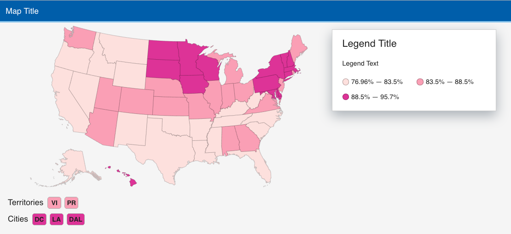
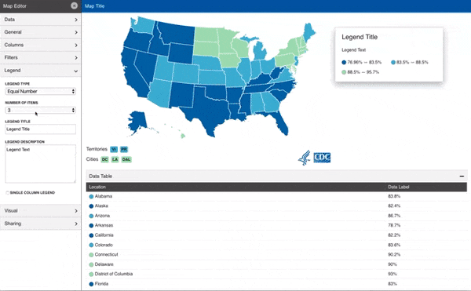

# CDC Maps



`<CdcMap />` is a React component for visualizing your data on a map of the United States. This was built for the Centers for Disease Control and Prevention's internal use and has been open sourced. There is support for filtering, toggling, numeric and categorical mapping as well as many other visual configuration options like color schemes.

It builds off the foundational work done on using D3 Geo and React by [React Simple Maps](https://github.com/zcreativelabs/react-simple-maps).

**This repository was created for use by CDC programs. Github is not hosted by the CDC, but is used by CDC and its partners to share information and collaborate on software.**

## Demos

The following are examples to show various examples of CDC Maps in action:
* [Example Numeric Maps](https://www.cdc.gov/wcms/4.0/cdc-wp/data-presentation/examples/example-numeric-maps.html)
* [Example Categorical Map](https://www.cdc.gov/wcms/4.0/cdc-wp/data-presentation/examples/example-categorical-maps.html)
* [Example Filterable Map](https://www.cdc.gov/wcms/4.0/cdc-wp/data-presentation/examples/example-numeric-maps-filterable.html)

## Installation

```sh
npm install cdc-map
```

## Usage

1 . Import the component at the top of your file.
```js
import CdcMap from 'cdc-map'
import 'cdc-map/build/static/css/index.css'
```

2 . Use the component freely in your React application.
```jsx
import React from 'react';
import CdcMap from 'cdc-map'
import 'cdc-map/build/static/css/index.css'

function App() {
  return (
    <div className="App">
        <CdcMap />
    </div>
  );
}

export default App;
```

### Parameters

The component supports two different methods of loading a configuration. You can pass it directly as an object or via an external JSON configuration url.

1. Loading an object using the `config` parameter.
```jsx
const configObj = {...}

<CdcMap config={configObj} />
```
2. Loading an external URL using the `configUrl` parameter.
```jsx
<CdcMap configUrl="http://example.com/configuration.json" />
```

### Data Formatting
The actual data that you are mapping needs to be formatted in a specific way where there is one column for each row that represents the state or city for the rest of the data on that row. There needs to be an additional column that represents the data you are trying to display on the map. This can be categorical or numerical data. You will specifically map these columns in the editor.

The supported formats are CSV and JSON files.

Reference the `/example-data/` folder for examples of both.

For more information, read the [CDC's official guidance](https://www.cdc.gov/wcms/4.0/cdc-wp/data-presentation/instructions/data-map-instructions.html) on how to use the map tool.

### Editor



While it is possible to hand edit values in the configuration object, it is easier to use the editor which will help you quickly build the map you want to display. To enable it in your project simply pass it as a property to the component with no configuration:

```js
<CdcMap editor={true} />
```

This will load the map with its default configuration file (located in `/src/json/default.json`) and the editor pane open. Once you have configured the map as you wanted, click "Create Configuration Object" and you will get a string of JSON you can use for that map.

### Things to Avoid

* **Avoid restricting the width below 675px on fullsize screens.**
CDC Maps was originally designed to utilize full viewport width and be embedded in an iframe. It's responsive but the viewport width of the page must be below a certain size for that to take effect. Including the component at smaller widths than 675px can lead to unforseen rendering issues.
* **Do not use this component where a parent element has `position: relative` set.**
The tooltips are positioned absolutely relative to the viewport they're in. If you're including the component inside an element where `position: relative` is set they will be relative to that container element, causing the tooltips to be offset.

## Public Domain
This repository constitutes a work of the United States Government and is not
subject to domestic copyright protection under 17 USC § 105. This repository is in
the public domain within the United States, and copyright and related rights in
the work worldwide are waived through the [CC0 1.0 Universal public domain dedication](https://creativecommons.org/publicdomain/zero/1.0/).
All contributions to this repository will be released under the CC0 dedication. By
submitting a pull request you are agreeing to comply with this waiver of
copyright interest.

## License
The repository utilizes code licensed under the terms of the Apache Software
License and therefore is licensed under ASL v2 or later.

This source code in this repository is free: you can redistribute it and/or modify it under
the terms of the Apache Software License version 2, or (at your option) any
later version.

This source code in this repository is distributed in the hope that it will be useful, but WITHOUT ANY
WARRANTY; without even the implied warranty of MERCHANTABILITY or FITNESS FOR A
PARTICULAR PURPOSE. See the Apache Software License for more details.

You should have received a copy of the Apache Software License along with this
program. If not, see http://www.apache.org/licenses/LICENSE-2.0.html

The source code forked from other open source projects will inherit its license.


## Privacy
This repository contains only non-sensitive, publicly available data and
information. All material and community participation is covered by the
Surveillance Platform [Disclaimer](https://github.com/CDCgov/template/blob/master/DISCLAIMER.md)
and [Code of Conduct](https://github.com/CDCgov/template/blob/master/code-of-conduct.md).
For more information about CDC's privacy policy, please visit [http://www.cdc.gov/privacy.html](http://www.cdc.gov/privacy.html).

## Contributing
Anyone is encouraged to contribute to the repository by [forking](https://help.github.com/articles/fork-a-repo)
and submitting a pull request. (If you are new to GitHub, you might start with a
[basic tutorial](https://help.github.com/articles/set-up-git).) By contributing
to this project, you grant a world-wide, royalty-free, perpetual, irrevocable,
non-exclusive, transferable license to all users under the terms of the
[Apache Software License v2](http://www.apache.org/licenses/LICENSE-2.0.html) or
later.

All comments, messages, pull requests, and other submissions received through
CDC including this GitHub page are subject to the [Presidential Records Act](http://www.archives.gov/about/laws/presidential-records.html)
and may be archived. Learn more at [http://www.cdc.gov/other/privacy.html](http://www.cdc.gov/other/privacy.html).

## Records
This repository is not a source of government records, but is a copy to increase
collaboration and collaborative potential. All government records will be
published through the [CDC web site](http://www.cdc.gov).

## Notices
Please refer to [CDC's Template Repository](https://github.com/CDCgov/template)
for more information about [contributing to this repository](https://github.com/CDCgov/template/blob/master/CONTRIBUTING.md),
[public domain notices and disclaimers](https://github.com/CDCgov/template/blob/master/DISCLAIMER.md),
and [code of conduct](https://github.com/CDCgov/template/blob/master/code-of-conduct.md).